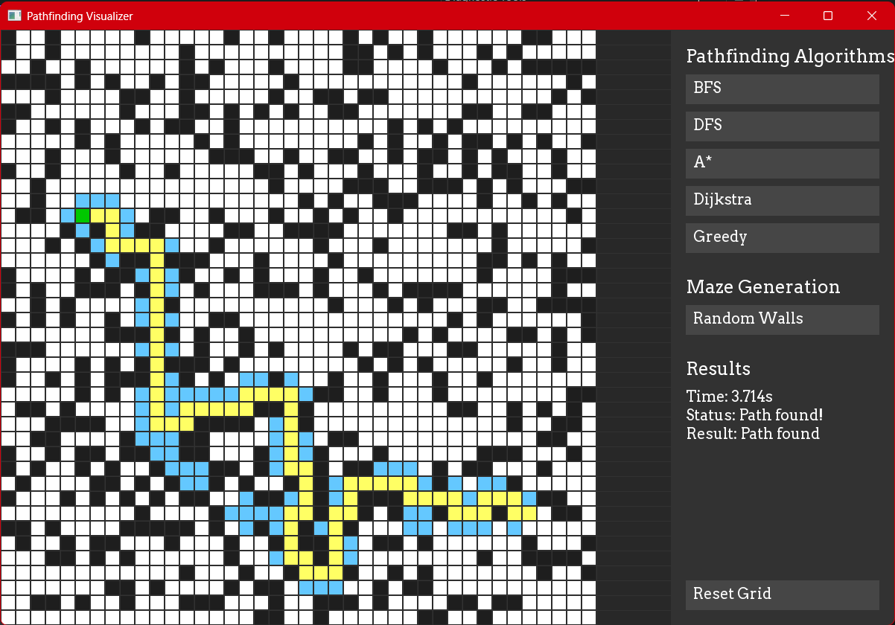

# Pathfinding Visualizer
 

## Table of Contents
1. [Introduction](#introduction)
2. [Features](#features)
3. [Algorithms Explained](#algorithms-explained)
   - [Breadth-First Search (BFS)](#breadth-first-search-bfs)
   - [Depth-First Search (DFS)](#depth-first-search-dfs)
   - [A* Algorithm](#a-algorithm)
   - [Dijkstra's Algorithm](#dijkstras-algorithm)
   - [Greedy Best-First Search](#greedy-best-first-search)
4. [How to Use](#how-to-use)
5. [Folder Structure](#folder-structure)
6. [Dependencies](#dependencies)
7. [License](#license)

---

## Introduction
This project is a **Pathfinding Visualizer** that demonstrates various pathfinding algorithms in action. It allows users to visualize how different algorithms find the shortest path between a start and end point on a grid. The project is built using **C++** and **SFML** for graphics.

---

## Features
- **Interactive Grid**: Place walls, set start/end points, and generate random mazes.
- **Multiple Algorithms**: Visualize BFS, DFS, A*, Dijkstra, and Greedy Best-First Search.
- **Real-Time Visualization**: Watch the algorithm explore the grid step-by-step.
- **Benchmarking**: Measure the time taken by each algorithm to find the path.

---

## Algorithms Explained

### Breadth-First Search (BFS)
BFS explores all neighboring nodes at the present depth before moving on to nodes at the next depth level. It guarantees the shortest path in an unweighted graph.

#### How It Works:
1. Start at the initial node.
2. Explore all neighbors at the current depth.
3. Move to the next level of neighbors.

#### Pseudocode:
```python
queue = [start]
visited = set(start)

while queue:
    node = queue.pop(0)
    if node == goal:
        return path
    for neighbor in neighbors(node):
        if neighbor not in visited:
            visited.add(neighbor)
            queue.append(neighbor)
```

#### Visualization:
```
S -> 1 -> 2 -> 3
     |    |    |
     4 -> 5 -> 6
          |    |
          7 -> G
```

---

### Depth-First Search (DFS)
DFS explores as far as possible along each branch before backtracking. It does **not** guarantee the shortest path.

#### How It Works:
1. Start at the initial node.
2. Explore one neighbor as far as possible.
3. Backtrack and explore other neighbors.

#### Pseudocode:
```python
stack = [start]
visited = set(start)

while stack:
    node = stack.pop()
    if node == goal:
        return path
    for neighbor in neighbors(node):
        if neighbor not in visited:
            visited.add(neighbor)
            stack.append(neighbor)
```

#### Visualization:
```
S -> 1 -> 2 -> 3
          |
          4 -> 5 -> G
```

---

### A* Algorithm
A* is a heuristic-based algorithm that combines the advantages of Dijkstra's algorithm and Greedy Best-First Search. It uses a cost function `f(n) = g(n) + h(n)`, where:
- `g(n)` is the cost from the start node to the current node.
- `h(n)` is the heuristic estimate of the cost from the current node to the goal.

#### Heuristic (Manhattan Distance):
```
h(n) = |x1 - x2| + |y1 - y2|
```

#### How It Works:
1. Start at the initial node.
2. Evaluate the cost `f(n)` for all neighbors.
3. Move to the node with the lowest `f(n)`.

#### Pseudocode:
```python
open_set = {start}
g_score = {start: 0}
f_score = {start: h(start)}

while open_set:
    current = node in open_set with lowest f_score
    if current == goal:
        return path
    open_set.remove(current)
    for neighbor in neighbors(current):
        tentative_g = g_score[current] + d(current, neighbor)
        if tentative_g < g_score[neighbor]:
            g_score[neighbor] = tentative_g
            f_score[neighbor] = tentative_g + h(neighbor)
            open_set.add(neighbor)
```

#### Visualization:
```
S -> 1 -> 2 -> 3
     |    |    |
     4 -> 5 -> 6
          |    |
          7 -> G
```

---

### Dijkstra's Algorithm
Dijkstra's algorithm finds the shortest path in a weighted graph. It uses a priority queue to always expand the least-cost node.

#### How It Works:
1. Start at the initial node.
2. Assign a tentative cost to all nodes (infinity for all except the start node).
3. At each step, select the node with the lowest tentative cost.
4. Update the costs of its neighbors.

#### Pseudocode:
```python
priority_queue = {start: 0}
distances = {start: 0}

while priority_queue:
    current = node in priority_queue with lowest cost
    if current == goal:
        return path
    for neighbor in neighbors(current):
        new_cost = distances[current] + d(current, neighbor)
        if new_cost < distances[neighbor]:
            distances[neighbor] = new_cost
            priority_queue[neighbor] = new_cost
```

#### Visualization:
```
S -> 1 -> 2 -> 3
     |    |    |
     4 -> 5 -> 6
          |    |
          7 -> G
```

---

### Greedy Best-First Search
Greedy Best-First Search uses a heuristic to prioritize nodes that are closer to the goal. It does **not** guarantee the shortest path.

#### How It Works:
1. Start at the initial node.
2. Always expand the node that appears to be closest to the goal.

#### Pseudocode:
```python
priority_queue = {start: h(start)}
visited = set(start)

while priority_queue:
    current = node in priority_queue with lowest h(n)
    if current == goal:
        return path
    for neighbor in neighbors(current):
        if neighbor not in visited:
            visited.add(neighbor)
            priority_queue[neighbor] = h(neighbor)
```

#### Visualization:
```
S -> 1 -> 2 -> 3
          |
          4 -> 5 -> G
```

---

## How to Use
1. **Set Start/End Points**:
   - Left-click to place the start and end points.
2. **Place Walls**:
   - Left-click to place walls.
   - Right-click to remove walls.
3. **Generate Random Walls**:
   - Click the "Maze Generation" button to generate random walls.
4. **Run Algorithms**:
   - Select an algorithm from the "Pathfinding Algorithms" section.
   - Watch the algorithm find the path in real-time.
5. **Reset Grid**:
   - Click the "Reset Grid" button to clear the grid.

---

## Folder Structure
```
PathfindingVisualizer/
├── bin/                  # Compiled executable and dependencies
│   ├── PathfindingVisualizer.exe
│   ├── sfml-graphics.dll
│   ├── sfml-window.dll
│   ├── sfml-system.dll
│   └── ...
├── assets/               # Assets (fonts, images, etc.)
│   ├── fonts/
│   │   └── arvo.ttf
│   ├── images/
│        └── program.png
│   
├── Source/               # Source code 
│   └── main.cpp
└── README.md             # This file
```

---

## Dependencies
- **SFML 2.6.0**: Graphics and window management.
- **C++17**: Required for modern C++ features.

---

## License
This project is licensed under the MIT License. See the [LICENSE](LICENSE) file for details.

---

Enjoy visualizing pathfinding algorithms! 🚀
