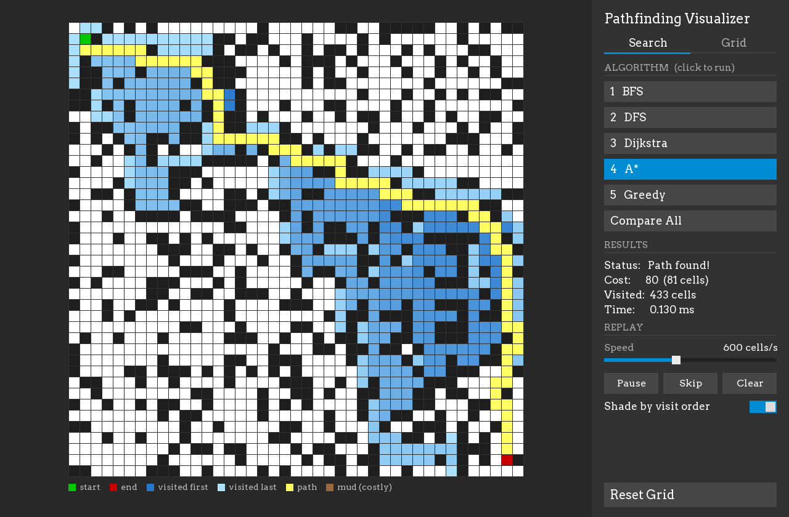

# Pathfinding Visualiser

[](https://github.com/anson10/Path-Finding-Visualiser/actions/workflows/ci.yml)

Five grid search algorithms (BFS, DFS, Dijkstra, A*, greedy best-first) as a small C++20
library, an SFML front end that replays their searches, property tests and a headless
benchmark. Cells carry an entry cost, so the grid can be a maze or weighted terrain, which is
where the algorithms actually differ.



*A\* on random walls: visited cells shade from dark blue (first) to light blue (last), yellow is the path. Rendered by the app
itself: `pathfinder-app --screenshot docs/astar-walls.png --scene walls --algorithm astar --seed 4`.*

## Design

```
include/pathfinder/   grid.hpp (grid, generators), search.hpp (search API)
src/                  the library: no graphics, no I/O
app/                  SFML visualiser: draws and replays, never searches step by step
tests/                Catch2 property tests
bench/                headless benchmark
```

- **Search returns data.** `pf::search(grid, start, goal, algorithm)` returns the path, its
  cost and the order in which cells were expanded. The app replays that order a few cells
  per frame, so the window stays responsive. The timing it shows, and everything the
  benchmark measures, is the search alone, with no drawing in the loop.
- **One cost model for every algorithm.** Each cell costs 0 (wall) or 1–255 to enter, and
  neighbours are visited in a fixed order. So a difference between two algorithms comes from
  the algorithm, not from tie order or bookkeeping.
- **Expanded means closed.** A cell counts as expanded when it leaves the frontier, not when
  it is queued, and is expanded at most once (Dijkstra, A* and greedy skip stale queue
  entries). That makes "cells expanded" comparable across algorithms; a test checks it.
- **A\* stays optimal on weighted grids.** Its Manhattan heuristic is scaled by the cheapest
  cell cost, so it never overestimates. Ties go to the deeper node. An optional weight w turns
  it into weighted A* (g + w·h), bounded at w times the optimum.
- **Mazes are perfect mazes,** carved by iterative recursive backtracking: exactly one path
  between any two open cells (a test checks it is a spanning tree). Random walls and weighted
  terrain are the other two generators. All three are seeded and deterministic.

## Results

`build/pathfinder-bench` on 501×501 grids, start (1,1) to goal (499,499), 25 seeds per
scenario (grids without a path are dropped), Release build with GCC 11 on a laptop (WSL2).
Times are medians and vary between machines; cells expanded and path costs don't.

**Random walls, 30% density, uniform cost**

| Algorithm | Time (ms) | Cells expanded | Path cost vs optimum |
|---|---|---|---|
| BFS | 17.3 | 172,494 | optimal |
| DFS | 2.9 | 33,962 | +1,839% |
| Dijkstra | 45.3 | 172,495 | optimal |
| A* | 7.1 | 18,961 | optimal |
| Greedy | 1.3 | 1,893 | +33% |
| A* w=1.5 | 2.0 | 2,454 | +8.8% |
| A* w=2 | 1.5 | 2,275 | +16% |
| A* w=5 | 1.4 | 1,925 | +27% |

**Weighted terrain, costs 1–9, 20% walls**

| Algorithm | Time (ms) | Cells expanded | Path cost vs optimum |
|---|---|---|---|
| BFS | 14.7 | 200,395 | +45% |
| DFS | 2.2 | 30,870 | +3,484% |
| Dijkstra | 60.8 | 200,394 | optimal |
| A* | 72.2 | 200,386 | optimal |
| Greedy | 1.3 | 1,149 | +77% |
| A* w=2 | 73.1 | 200,329 | +0.1% |
| A* w=3 | 68.8 | 158,289 | +0.6% |
| A* w=5 | 1.3 | 1,431 | +13.7% |

What the numbers say:

- **On uniform cost, A\* expands 11% of the cells BFS and Dijkstra do** and is 6× faster than
  Dijkstra, with the same optimal path.
- **On weighted terrain plain A\* gains nothing.** Its admissible heuristic (distance × the
  cheapest cell cost, 1) is far below the average cost of a step (~5), so it barely guides the
  search: it expands as much as Dijkstra and pays for computing the heuristic.
- **Weighted A\* fixes that, at a bounded price.** Ordering by g + w·h gives up optimality but
  guarantees a path at most w times the cheapest (a test checks the bound on random grids). On
  terrain nothing happens until w approaches the average step cost: at w = 3 it still expands
  158k cells, at **w = 5 it expands 1,431 (140× fewer than Dijkstra) and runs 45× faster, for a
  path 13.7% costlier**. On uniform grids w = 1.5 already cuts expansions 7.7× for +8.8%.
- **BFS ignores cost.** On terrain it takes 45% more expensive paths. It is still the fastest
  optimal search on uniform grids, since a FIFO queue is cheaper than a heap.
- **Greedy is fastest and wrong,** 33–77% off the optimum. DFS is worse.
- In a perfect maze every algorithm finds the only path; even w = 5 saves only 11% of A*'s
  expansions, because a maze leaves no shortcut to aim for.

**Compare All** runs the five algorithms on the grid on screen. On this weighted terrain BFS
pays 389 and greedy 430, Dijkstra finds the optimum of 253 after visiting 1,440 cells, and A*
with weight 5 finds a path of 270 (7% more) after visiting only 84:


## Tests

`ctest --test-dir build` runs 15 Catch2 test cases (about 2,650 assertions), most of them
properties checked on hundreds of seeded random grids:

- every returned path is a valid walk of passable neighbours, with the reported cost;
- all algorithms agree on whether the goal is reachable; a walled-off goal is "not found"
  after exploring exactly the reachable cells;
- A* always matches Dijkstra's cost and never expands more cells; weighted A* stays within
  w times the optimum for w from 1.2 to 5, and weight 1 is exactly plain A*;
- on uniform cost BFS is optimal, and DFS and greedy never beat it; on terrain BFS is not
  (a hand-built case where the short route is the expensive one);
- every cell is expanded at most once;
- a perfect maze is connected and a tree.

The tests catch a broken algorithm, not just a crash: making the A* heuristic overestimate
(×3) fails the A*-matches-Dijkstra property, and a weight secretly 4× too strong fails the
weighted-A* bound. CI builds with GCC and Clang (warnings as
errors) and runs the tests again under AddressSanitizer and UBSan.

## Build and run

Needs CMake 3.20+, a C++20 compiler and, for the app only, SFML 2.5 or 2.6 (`sudo apt install
libsfml-dev`). Catch2 is fetched by CMake.

```bash
cmake -S . -B build -G Ninja
cmake --build build
ctest --test-dir build              # tests
build/pathfinder-bench              # benchmark (--size N --seeds K)
build/pathfinder-app                # the visualiser
```

Without SFML the library, tests and benchmark still build. `-DPATHFINDER_SANITIZE=ON` builds
with sanitizers.

**The app:** the panel has two tabs.

- **Search:** click an algorithm to run it (or `1`–`5`; `Space` runs it again). The visited
  cells fill in at the replay speed, then the path traces back from the end. **Compare All**
  (`A`) runs all five on the current grid and lists their cost and cells visited. The **A\*
  weight** slider (1–6) turns A* into weighted A*. Pause (`P`),
  skip (`E`) or clear the replay; "Shade by visit order" colours visited cells from dark blue
  (first) to light blue (last), so you can watch the search spread.
- **Grid:** Empty, Random, Maze or Terrain, with sliders for size, wall density and seed.
  Pick a drawing tool (Wall, Mud with its cost, Erase) and drag on the grid; right-drag
  erases, shift-drag paints mud, and dragging the green or red cell moves the start or end.

Hovering a cell shows its cost under the grid. The window can be resized, and Reset Grid
clears everything.

## License

MIT
