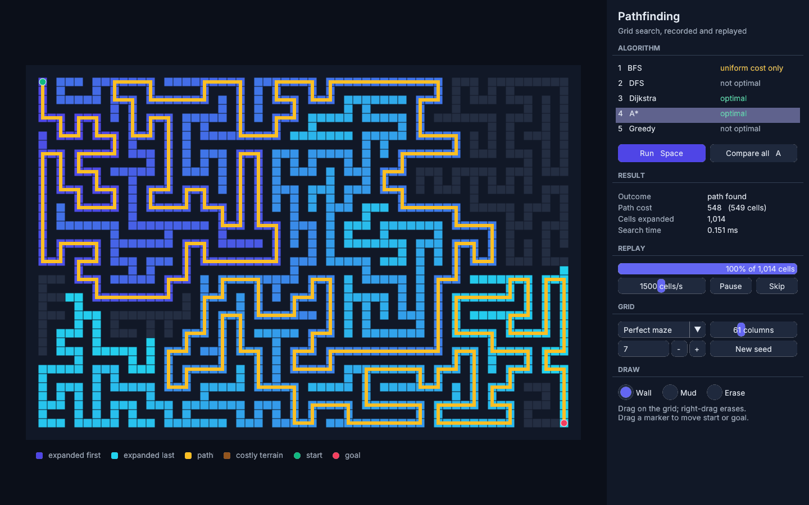
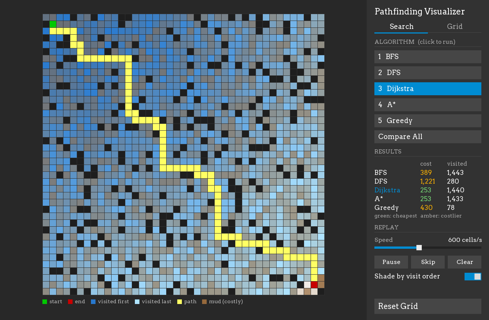

# Pathfinding Visualiser

[](https://github.com/anson10/Path-Finding-Visualiser/actions/workflows/ci.yml)

Five grid search algorithms (BFS, DFS, Dijkstra, A*, greedy best-first) as a small C++20
library, an SFML front end that replays their searches, property tests and a headless
benchmark. Cells carry an entry cost, so the grid can be a maze or weighted terrain, which is
where the algorithms actually differ.



*A\* in a perfect maze: cells are coloured by when the search reached them (indigo first,
cyan last), dark cells were never expanded, amber is the path. Rendered by the app itself:
`pathfinder-app --screenshot docs/maze-astar.png --scene maze --algorithm astar --seed 7`.*

## Design

```
include/pathfinder/   grid.hpp (grid, generators), search.hpp (search API)
src/                  the library: no graphics, no I/O
app/                  SFML + Dear ImGui visualiser: draws and replays, never searches step by step
tests/                Catch2 property tests
bench/                headless benchmark
```

- **Search returns data.** `pf::search(grid, start, goal, algorithm)` returns the path, its
  cost and the order in which cells were expanded. The app replays that order a few cells
  per frame, so the window stays responsive. The timing it shows, and everything the
  benchmark measures, is the search alone, with no drawing in the loop.
- **One cost model for every algorithm.** Each cell costs 0 (wall) or 1–255 to enter, and
  neighbours are visited in a fixed order. So a difference between two algorithms comes from
  the algorithm, not from tie order or bookkeeping.
- **Expanded means closed.** A cell counts as expanded when it leaves the frontier, not when
  it is queued, and is expanded at most once (Dijkstra, A* and greedy skip stale queue
  entries). That makes "cells expanded" comparable across algorithms; a test checks it.
- **A\* stays optimal on weighted grids.** Its Manhattan heuristic is scaled by the cheapest
  cell cost, so it never overestimates. Ties go to the deeper node.
- **Mazes are perfect mazes,** carved by iterative recursive backtracking: exactly one path
  between any two open cells (a test checks it is a spanning tree). Random walls and weighted
  terrain are the other two generators. All three are seeded and deterministic.

## Results

`build/pathfinder-bench` on 501×501 grids, start (1,1) to goal (499,499), 25 seeds per
scenario (grids without a path are dropped), Release build with GCC 11 on a laptop (WSL2).
Times are medians and vary between machines; cells expanded and path costs don't.

**Random walls, 30% density, uniform cost**

| Algorithm | Time (ms) | Cells expanded | Path cost vs optimum |
|---|---|---|---|
| BFS | 12.1 | 172,494 | optimal |
| DFS | 1.9 | 33,962 | +1,839% |
| Dijkstra | 34.7 | 172,495 | optimal |
| A* | 5.9 | 18,961 | optimal |
| Greedy | 0.8 | 1,893 | +33% |

**Weighted terrain, costs 1–9, 20% walls**

| Algorithm | Time (ms) | Cells expanded | Path cost vs optimum |
|---|---|---|---|
| BFS | 11.3 | 200,395 | +45% |
| DFS | 1.4 | 30,870 | +3,484% |
| Dijkstra | 44.3 | 200,394 | optimal |
| A* | 49.0 | 200,386 | optimal |
| Greedy | 0.7 | 1,149 | +77% |

What the numbers say:

- **On uniform cost, A\* expands 11% of the cells BFS and Dijkstra do** and is 6× faster than
  Dijkstra, with the same optimal path.
- **On weighted terrain A\* gains nothing.** Its admissible heuristic (distance × the minimum
  cost, 1) is far below the average cost of a step (~5), so it barely guides the search: it
  expands as much as Dijkstra and pays for computing the heuristic. A tighter heuristic would
  give up the optimality guarantee.
- **BFS ignores cost.** On terrain it takes 45% more expensive paths. It is still the fastest
  optimal search on uniform grids, since a FIFO queue is cheaper than a heap.
- **Greedy is fastest and wrong,** 33–77% off the optimum. DFS is worse.
- In a perfect maze every algorithm finds the only path; A* saves 3% of the expansions.

**Compare all** runs the five algorithms on the grid on screen. On this weighted terrain BFS
pays 493 and greedy 642, while Dijkstra and A* both find the optimum of 365; A* expands 1,818
cells against Dijkstra's 1,827, the weak-heuristic effect from the table above:



## Tests

`ctest --test-dir build` runs 13 Catch2 test cases (about 1,850 assertions), most of them
properties checked on hundreds of seeded random grids:

- every returned path is a valid walk of passable neighbours, with the reported cost;
- all algorithms agree on whether the goal is reachable; a walled-off goal is "not found"
  after exploring exactly the reachable cells;
- A* always matches Dijkstra's cost and never expands more cells;
- on uniform cost BFS is optimal, and DFS and greedy never beat it; on terrain BFS is not
  (a hand-built case where the short route is the expensive one);
- every cell is expanded at most once;
- a perfect maze is connected and a tree.

The tests catch a broken algorithm, not just a crash: making the A* heuristic overestimate
(×3) fails the A*-matches-Dijkstra property. CI builds with GCC and Clang (warnings as
errors) and runs the tests again under AddressSanitizer and UBSan.

## Build and run

Needs CMake 3.25+, a C++20 compiler and, for the app only, SFML 2.5 or 2.6 and OpenGL (`sudo apt
install libsfml-dev libgl-dev`). Catch2, Dear ImGui and ImGui-SFML are fetched by CMake at
pinned versions.

```bash
cmake -S . -B build -G Ninja
cmake --build build
ctest --test-dir build              # tests
build/pathfinder-bench              # benchmark (--size N --seeds K)
build/pathfinder-app                # the visualiser
```

Without SFML the library, tests and benchmark still build. `-DPATHFINDER_SANITIZE=ON` builds
with sanitizers.

**The app:** a resizable window with a Dear ImGui side panel. Pick an algorithm (`1`–`5`),
**Run** (`Space`) or **Compare all** (`A`) to get a table of all five on the current grid.
The replay runs at a set number of cells per second; **Pause** (`P`), **Skip** (`E`), `C`
clears the search. The Grid section switches between an empty grid, a perfect maze, random
walls and weighted terrain, with size, wall density and seed. Drag on the grid to draw walls or
mud (pick the tool and the mud cost), right-drag to erase, drag the green or red marker to move
the start or goal; strokes are continuous however fast the mouse moves.

## License

MIT
